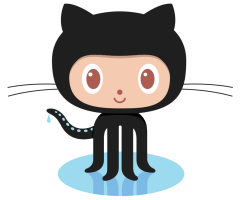

# Using a code repository (_git, GitHub_)

## Why `git`?


Using just the CG IDE in your browser is convenient: it takes care of saving your code, you can even access all your earlier submissions via the `Results / History` menu. However, you should not rely solely on this. Have a local collection of all your code you have written.

Moreover, having just a bunch of files in some folders on your hard drive quickly becomes unmanagable, so use a _source code management_ tool (also known as a _version control system_). While there are (were?) other tools as well, `git` became a de-facto monopoly in this field.
Benefits:

* Many CG puzzles require similar concepts. You can reuse code - but only if you can find it. This is much easier if you have everything together, with full text search, etc.
* The code you write is yours. Whatever happens to CodinGame or your CG account, you shall never loose your code.
* Sometimes we screw up things and need to revert the changes. With `git` it is very easy to turn back the wheel of time to any point when you commited code into the repository. You never need to worry of overwriting or modifying something you regret later. I commit my code to the repo at the end of every coding session. Sometimes even during a session before I do some refactoring.

## Why `GitHub`?



While having a local version control is fine, if you loose your filesystem, you are still screwed. `GitHub` is the largest free code hosting platform in the cloud. (But not the only one, so feel free to use [GitLab](https://about.gitlab.com/), [BitBucket](https://bitbucket.org/), etc instead.)
Benefits:

* Syncing up your local repo with GitHub provides instant cloud backup for your code.
* You can access your code easily from multiple devices. You can still maintain a 'single source of truth', instead of relying on file dates with a risk of accidentaly overwriting the most recent version with an older file.
* On a code hosting site there is much focus on ease of collaboration, code and knowledge sharing and teamwork. However, CodinGame's Code of Conduct prohibits to share your solution codes publicly, as this would ruin the challenge for others. So just don't do that, always keep your CG-related repos `private`.

## Installing `git`

There are plenty of git tutorials on the web, so I will remain brief here.

* Depending on your OS, `git` might come already preinstalled. Try it out with `git --version`.
* Download it from the [git website](https://git-scm.com/) and install. Make sure that your git installation's `cmd` folder is added to your `PATH`.
* While it comes with a client GUI, we won't need it (especially as in the next chapter we will move to the `VS Code` IDE, which has excellent `git` and `GitHub` support).
* Do some basic one-time setup:

```bash
git config --global user.name "Your Name"
git config --global user.email yourmailaddress@yourdomainname.com
git config --global init.defaultBranch main
```

## Registering at `GitHub`

Registration on [GitHub](https://www.github.com/) is quite straightforward and you are good to go. Besides the `Free` plan they have a paid `Pro` service, but we won't need it. GitHub also provides a [command line tool](https://cli.github.com/) (`gl`), but its usage is optional and not really essential.

## Setting up a code repository for your CG solutions

Usually one should make a separate git repo for every project, keeping only the project-related files together. However, you can have hundreds of CG solutions (1 file each), making separate repo would be an overkill. I have a single repo for all my php CG solutions (700+ files), plus another repo for all the other languages (26 languages with typically ~40 simple solutions each, so 1000+ files). With such high number of files keeping things organised is a must.

For example, I use directories per CG game type and per difficulty, with a strict naming convention also for filenames:


* Create a directory and initialize your local repo:

```bat
mkdir reponame
cd reponame
git init
```

* Sign in to your `GitHub` account  and [create a new repo there](https://github.com/new). Preferably choose the same name for the repo as the local directory name you have chosen above.
* __For CG puzzles: make sure you set your repo to be 'private'__.
* Now connect your local repo with the github repo you created:
    * At first time you need to provide your github credentials. Later you don't need to type in passwords or access tokens if using the same machine.

```bash
git remote add origin "https://github.com/your-github-profile-name/reponame.git"
git pull origin main
git status
```

* To make sure that everything is OK, let's create a php source file in the repo directory and commit it to the repo.

```bash
git add -A
git commit -m "initial commit"
git push origin main
git status
```

* Now if you visit your account on GitHub, the new php file should appear under the repository you created.

## Excluding some files from your repo

There can be files that you don't want to commit into your repository, especially if they are changing frequently.

Examples:

* In the previous chapter we redirected the output of our local php run into a `output_01.txt` file.
* We will introduce some dev tools in later chapters which will create a cache file to speed up subsequent runs.

You can add a `.gitignore` file to your repo directory, listing all the patterns to exclude.

For example, this is my gitignore file for my 'CG solutions' repo:

```bash
/.temp/
/.tools/phpstan/
/.tools/.php-cs-fixer.cache
/.tools/.phpcs.cache
/.tools/*.txt
/vendor/
/**/output*.txt
```

## Useful links

* [Git](https://git-scm.com/)
* [Pro Git](https://git-scm.com/book/en/v2), a free book: at least the first few chapters are definitely worth reading.
* [GitHub](https://www.github.com/)

## Coming next

As we have our code repository, now it is time to write some code at last. Let's see how a modern IDE can help us!
