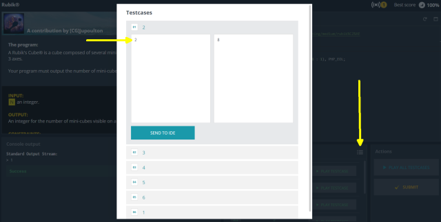

# Running your code locally (_php_)


## Why?

So, if `CodinGame` provides everything, including a runtime environment, why do we need at all to be able to run your code locally? Well, in 95% of the cases we just don't. But it can make sense when:

* If you have a non-obvious __bug__, it is much easier to debug it in the IDE, using breakpoints, line-by-line execution, variable inspection, etc. (_more details in a later chapter_)
* If you have __timeout__ in a CG puzzle, you might want to know how 'far' are you from passing. So run it locally where it can run longer, measure the running time with `hrtime()` and print it to the console.
* For some optim puzzles you can pre-calculate some validator results locally without the time constraint, then __hard-code__ it. It means that in the submitted code you just detect the input and send the correct output you store in your source as some string. Not a nice thing, feels like a hack. I used this approach only in the [2048 puzzle](https://www.codingame.com/multiplayer/optimization/2048) to try out the approach.
* To improve your bot in [bot programming games](https://www.codingame.com/multiplayer/bot-programming) or contests you can set up local __self-play__ to try out new things without submitting to the arena. I used this approach to fine-tune some hyperparameters ('magic constants') in my code.

## Installing `PHP`

Depending on your OS, `php` might come already preinstalled, although it might be an older release. Try it out with `php --version`. While at the time of this writing CodinGame shamefully supports only `v7.3` (released in 2018...), for your local environment you should go for the latest stable release (`v8.1`).

* If using `Ubuntu 20.04 LTS` (directly or with `Windows Subsystem for Linux (WSL)`), it came with php `v7.4` only, so there you needed to add an extra repository to upgrade. However, `Ubuntu 22.04 LTS` already contains php `v8.1` so it is best to upgrade the whole OS. Other Linux distros might have different status.
* For `Windows` you can just download and unzip the latest release from the the [core php site](https://windows.php.net/download). You shall add its directory to the `PATH`, so you can run `php` from anywhere.
* It might be more convenient to use a pre-packaged version. I use [XAMPP](https://www.apachefriends.org/) that contains some additional useful stuff such as a web server and a database besides PHP itself (not needed for CodinGame puzzles though.) There are other similar packages as well.
* `Mac` users: I have no experience with it, so just google it...
* Using docker containers is also possible.

## Optional: enabling JIT

The default config file php comes with works fine, but the JIT compiler (available from `v8.0`) is turned off. While not a huge boost for typical web applications, for a computing-intensive CG puzzle the speedup is usually substantial: in my experience 2x to 3x.

To enable JIT, just uncomment / add / modify the following lines in your `php.ini` file:

```ini
zend_extension=opcache
opcache.enable=1
opcache.enable_cli=1
opcache.jit_buffer_size=256M
opcache.jit=tracing
opcache.revalidate_freq=1
```

While unrelated to JIT, I also recommended to increase the memory available to php, or even to set it to unlimited with `memory_limit=-1`

You can check if JIT is working by running:

```bash
php -r "var_dump(opcache_get_status()['jit']);"
```

## Running a puzzle solution locally

While solo puzzle test cases are handled automaticaly on the CG site, locally we have to set up the input manually (as we do not want to type them at every run). In case of a solo puzzle, just select a testcase and copy-paste the input into a local file:


For example, after saving the input to `input_01.txt`, run the test case with:

```bash
php my_solution.php < input_01.txt > output_01.txt 2>&1
```

...and check the result (what your code wrote to the standard output) in `output_01.txt`.

Note: by adding `2>&1` above we redirected the error log also to the same file.

To run multiple test cases after each other, you can make a small batch file or shell script by copying and editing the above command line with different filenames.

* _Beware:_ When creating a local test case input file, make sure to save it with Linux line ending `LF` instead of the Windows default `CRLF`, otherwise the input parsing might not work correctly.

## Useful links

* [PHP.net](https://www.php.net/), the core language site (language documentation, releases, etc).
* [XAMPP](https://www.apachefriends.org/), a pre-packaged php distro for Windows, Max or Linux (includes Apache httpd, MariaDB, PHP, Perl, Tomcat, phpMyAdmin)

## Coming next

Okay, we run our `php` code locally. But where shall we store our code?
