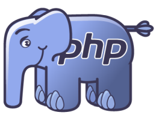

# Running your code locally (_php_)

## Why?

So, if `CodinGame` provides everything, including a runtime environment, why do you need at all to be able to run your code locally? Well, in 95% of the cases you just don't. But it can make sense when:

* If you have a non-obvious __bug__, it is much easier to debug it in the IDE, using breakpoints, line-by-line execution, variable inspection, etc. (_more details in a later chapter_)
* If you have __timeout__ in CG puzzle, you might want to know how 'far' you am from a correct solution. So run it locally where it can run longer, measure the running time with `hrtime()` and send the results to the console.
* For some optim puzzles you can pre-calculate some validator results locally without the time constraint, then __hard-code__ it. It means that in the submitted code you just detect the input and send the correct output. Not a nice thing, feels like a hack. I used this approach only in the [2048 puzzle](https://www.codingame.com/multiplayer/optimization/2048) to try it out.
* To improve your bot in [bot programming games](https://www.codingame.com/multiplayer/bot-programming) or contests you can set up local __self-play__ to try out new things without submitting to the arena. I used this approach to fine-tune some hyperparameters ('magic constants') in my code.

## Installing

Depending your OS, `PHP` might come already preinstalled, although it might be an older release. Try it out with `php --version`. While at the time of this writing CodinGame shamefully supports only `v7.3` (released in _2018_...), for your local environment you should go for the latest stable release (`v8.1`).

* If using `Ubuntu 20.04 LTS` (directly or with `Windows Subsystem for Linux (WSL)`), it came with php `v7.4` only, so there you needed to add an extra repository to upgrade. However, `Ubuntu 22.04 LTS` already contains php `v8.1` so it is best to upgrade the whole OS.
* For `Windows` you can just download and unzip the latest release from the the [core php site](https://windows.php.net/download). You shall add its directory to the `PATH` so you can run `php` from anywhere.
* It might be more convenient to use a pre-packaged version. I use [XAMPP](https://www.apachefriends.org/) that contains some additional useful stuff such as a web server and a database besides PHP itself (not needed for CodinGame puzzles though.) There are other similar packages as well.
* `Mac` users: I have no experience, google it...

## Optional: configuring JIT

TODO

## Useful links

* [PHP.net](https://www.php.net/), the core site for the language, including full language documentation and the downloading the original php distributions.
* [XAMPP](https://www.apachefriends.org/), a pre-packaged php distro for Windows, Max or Linux (also includes some other stuff, such as Apache http, MariaDB, Perl, Tomcat, phpMyAdmin)

## Coming next

Using a code repository (_git, GitHub_)
